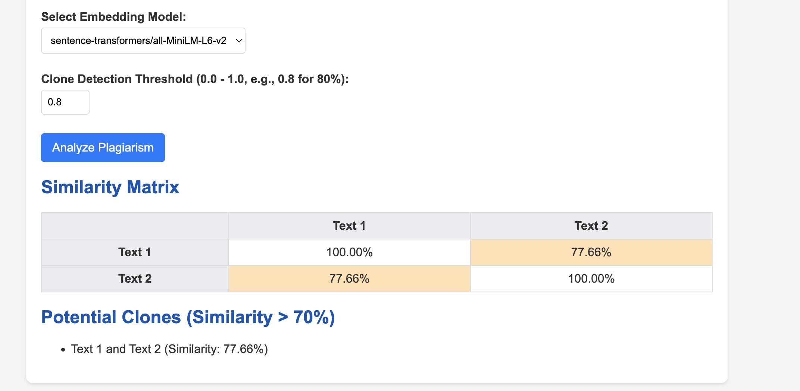
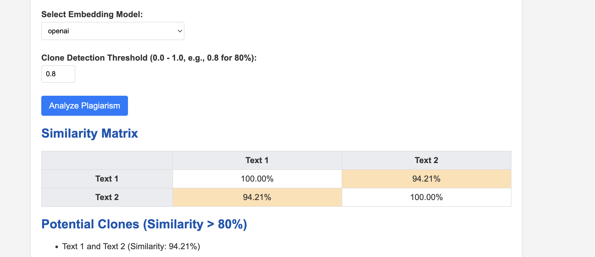

# Plagiarism Detector - Semantic Similarity Analyzer

This project implements a web-based plagiarism detector using semantic similarity comparison with various embedding models.

## Features:
- Dynamic text input boxes
- Semantic similarity comparison using embeddings (e.g., Sentence-Transformers, OpenAI embeddings)
- Display of similarity percentages between all text pairs
- Identification of potential clone texts (high similarity)
- Comparison report of different embedding models

## Technical Implementation:
- Text preprocessing for multiple inputs
- Embedding generation using multiple models
- Pairwise cosine similarity calculation
- Results visualization showing similarity matrix
- Clone detection based on similarity thresholds

## Setup:

1.  **Create a virtual environment (recommended):**

    ```bash
    python3 -m venv venv
    source venv/bin/activate
    ```

2.  **Install dependencies:**

    ```bash
    pip install -r requirements.txt
    ```

3.  **Run the application:**

    ```bash
    python app.py
    ```

4.  **Access the web interface:**

    Open your browser and navigate to `http://127.0.0.1:5000/`

## Screenshots





