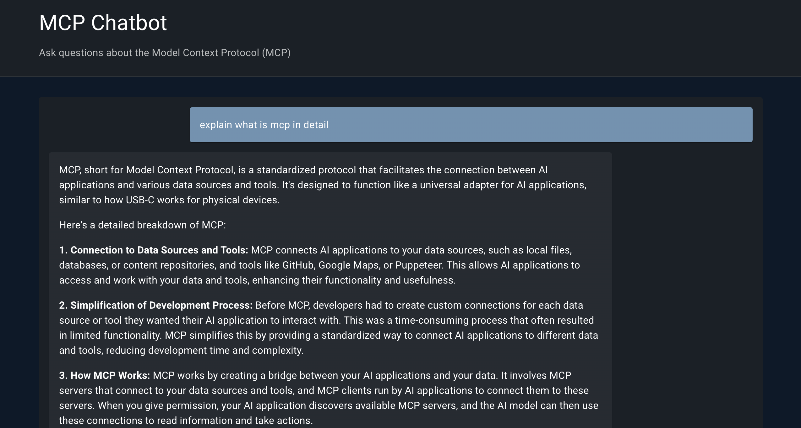
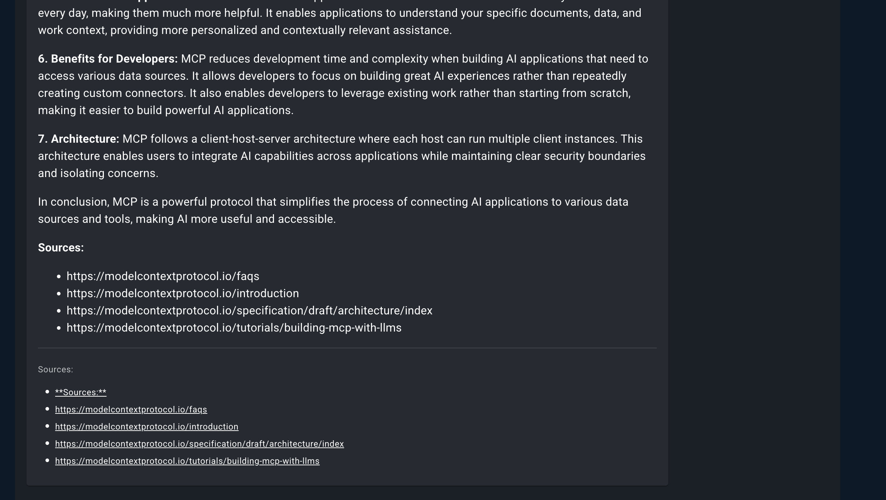

# Q1_MCP_ChatBot: Model Context Protocol (MCP) Q&A Chatbot

This project implements a Q&A chatbot designed to provide source-cited answers to technical questions about Model Context Protocol (MCP) servers. It leverages a Retrieval-Augmented Generation (RAG) pipeline, powered by FastAPI for the backend and a React application for the frontend.

## Table of Contents

- [Project Overview](#project-overview)
- [Features](#features)
- [Project Structure](#project-structure)
- [Setup and Installation](#setup-and-installation)
  - [Backend Setup](#backend-setup)
  - [Frontend Setup](#frontend-setup)
- [Usage](#usage)
- [API Endpoints](#api-endpoints)
- [Visuals](#visuals)

## Project Overview

The chatbot is built to answer technical questions related to MCP servers by ingesting data from various sources, including documentation and GitHub repositories. It uses a vector database (FAISS or Chroma) to store embeddings of the ingested data, enabling efficient retrieval of relevant information for generating accurate and source-cited responses.

## Features

- **Data Ingestion**: Supports ingestion of data from specified URLs (e.g., `Q1_MCP_ChatBot/url.text`) including documentation and GitHub repositories.
- **Retrieval-Augmented Generation (RAG)**: Integrates LangChain with OpenAI's GPT-4o-mini model to provide intelligent, context-aware responses.
- **FastAPI Backend**: Provides robust API endpoints for handling chat queries and managing data ingestion.
- **React Frontend**: A user-friendly web interface for interacting with the chatbot.
- **Vector Database**: Utilizes either FAISS or Chroma for efficient storage and retrieval of document embeddings.

## Project Structure

- `backend/`: Contains the Python backend application.
  - `app/`: Core application logic, including `config.py`, `ingest.py`, `main.py` (FastAPI app), `rag_chain.py`, and `vector_store.py`.
  - `data/`: Stores ingested data and the vector database.
  - `requirements.txt`: Python dependencies.
- `frontend/`: Contains the React web application.
  - `public/`: Static assets.
  - `src/`: React components and application logic.
- `.env`: Environment variables (should be ignored by Git).
- `.gitignore`: Specifies files and directories to be ignored by Git.
- `PRD.md`: Product Requirements Document.
- `url.text`: List of URLs for data ingestion.

## Setup and Installation

### Backend Setup

1.  **Navigate to the backend directory:**
    ```bash
    cd backend
    ```

2.  **Create and activate a virtual environment:**
    ```bash
    python3 -m venv venv
    source venv/bin/activate
    ```

3.  **Install Python dependencies:**
    ```bash
    pip install -r requirements.txt
    ```

4.  **Set environment variables:**
    Create a `.env` file in the root directory of the project (`Q1_MCP_ChatBot/`) with your OpenAI API key and desired model/vector database type:
    ```env
    OPENAI_API_KEY=sk-...
    MODEL_NAME=gpt-4o-mini  # or gpt-4o, etc.
    VECTOR_DB_TYPE=faiss    # or chroma
    ```

5.  **Ingest data:**
    This step populates your vector database with information from the URLs listed in `url.text`.
    ```bash
    python -m app.ingest
    ```

6.  **Run the API server:**
    ```bash
    uvicorn app.main:app --reload
    ```
    The backend API will be accessible, typically at `http://127.0.0.1:8000`.

### Frontend Setup

1.  **Navigate to the frontend directory:**
    ```bash
    cd frontend
    ```

2.  **Install Node.js dependencies:**
    ```bash
    npm install
    ```

3.  **Run the React development server:**
    ```bash
    npm start
    ```
    The frontend application will open in your browser, typically at `http://localhost:3000`.

## Usage

Once both the backend and frontend servers are running:

1.  Open your web browser and navigate to the frontend application URL (e.g., `http://localhost:3000`).
2.  Type your technical questions related to MCP servers into the chat interface.
3.  The chatbot will retrieve relevant information from its vector database and generate a source-cited answer.

## API Endpoints

The backend provides the following key endpoints:

-   `POST /chat`: Send a chat message to the chatbot.
    -   **Request Body**: `{"query": "Your question here"}`
    -   **Response**: Contains the generated answer and sources.
-   `POST /ingest`: Trigger data ingestion into the vector database.
    -   **Authentication**: This endpoint is typically for administrative use and may require authentication.

## Visuals

Below are some visual representations of the project or its output:



