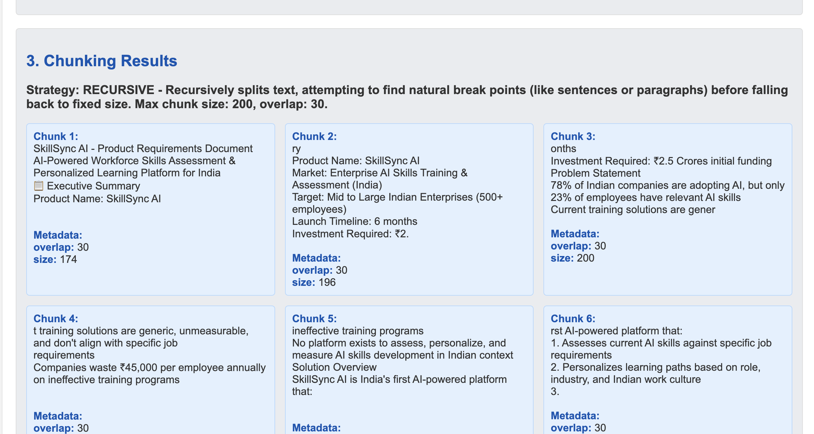

# RAG Chunking Strategy Visualizer

This web application allows users to upload PDF documents and visualize different chunking strategies for Retrieval-Augmented Generation (RAG) systems.

## Features

-   **PDF Upload & Text Extraction**: Upload PDF documents and extract their text content.
-   **Chunking Strategy Dropdown**: Explore and apply various chunking strategies.
    -   Fixed Size Chunking
    -   Sentence-Based Chunking
    -   Recursive Chunking
    -   Semantic Chunking
-   **Strategy Explanation**: Get a brief explanation of how each selected strategy works.
-   **Chunk Visualization**: View the resulting chunks with relevant metadata (e.g., size, overlap).

## Technical Requirements

-   Python 3.x
-   Flask (for the backend API)
-   PyPDF2 (for PDF text extraction)
-   NLTK (for text tokenization)
-   scikit-learn (for semantic chunking similarity calculation)
-   HTML/CSS/JavaScript (for the frontend)

## Setup and Run

Follow these steps to set up and run the application locally:

1.  **Clone the repository (if applicable):**

    ```bash
    # If this were a git repository
    # git clone <repository_url>
    # cd RAGIMPLE
    ```

2.  **Navigate to the project directory:**

    ```bash
    cd /Users/saurabhkumarjha/Desktop/misogi assignment/Large-Projects-with-Cursor-MCP-Intro/RAGIMPLE
    ```

3.  **Create a virtual environment (recommended):**

    ```bash
    python3 -m venv venv
    source venv/bin/activate
    ```

4.  **Install the required Python packages:**

    ```bash
    pip install -r requirements.txt
    ```

5.  **Run the Flask backend:**

    ```bash
    python app.py
    ```

    The Flask application will start and be accessible at `http://127.0.0.1:5000`.

6.  **Open the frontend:**

    Open your web browser and navigate to `http://127.0.0.1:5000/index.html` (or simply `http://127.0.0.1:5000` if you configure Flask to serve `index.html` as the default route, which is not done in this basic setup).

    Alternatively, you can directly open the `index.html` file in your browser, but note that for the JavaScript to make API calls to the Flask backend, you will need to serve `index.html` from a web server (like Flask itself, or by running a simple HTTP server).

## Usage

1.  **Upload PDF**: Click "Choose File" and select a PDF document, then click "Upload and Extract" to get the text.
2.  **Select Strategy**: Choose a chunking strategy from the dropdown. Adjust parameters like "Chunk Size" or "Overlap" if available for the selected strategy.
3.  **Apply Chunking**: Click "Apply Chunking" to see the text divided into chunks based on the chosen strategy. The chunks will be displayed with their metadata.

## Exploration Task Notes

This application provides a basic implementation of several chunking strategies. For a more in-depth exploration, consider:

-   **When to use each strategy**: The choice of strategy depends on the nature of the text and the downstream RAG task. For example, fixed-size is simple but can break semantic units, while sentence-based preserves sentence integrity.
-   **Trade-offs between chunk size and semantic coherence**: Smaller chunks might miss context but are more precise. Larger chunks retain more context but might introduce irrelevant information.
-   **How overlap affects retrieval performance**: Overlap helps maintain context across chunk boundaries, reducing the chance of losing critical information when a query spans two chunks.

## Output


